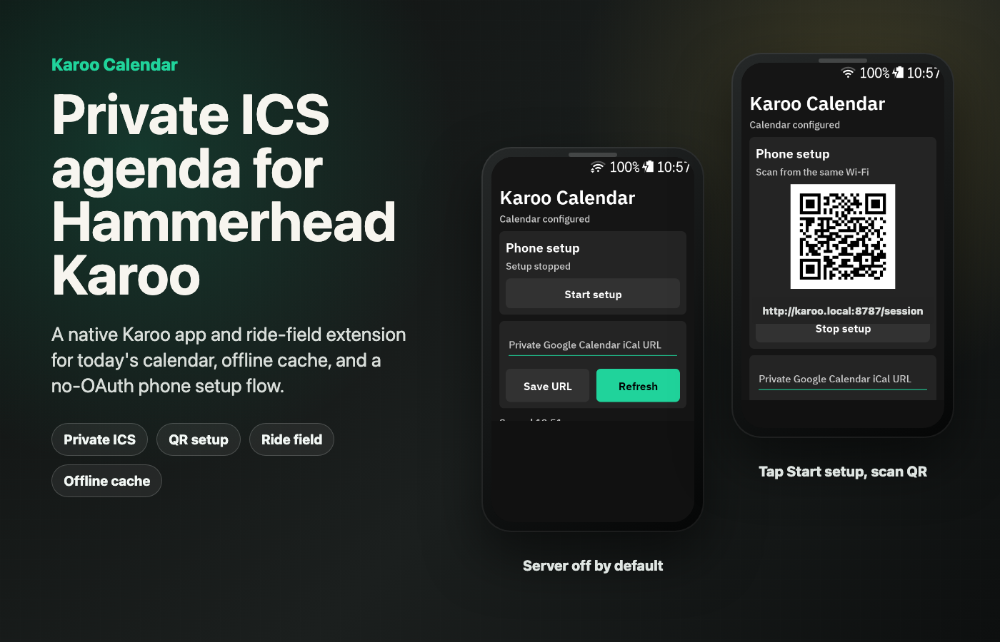
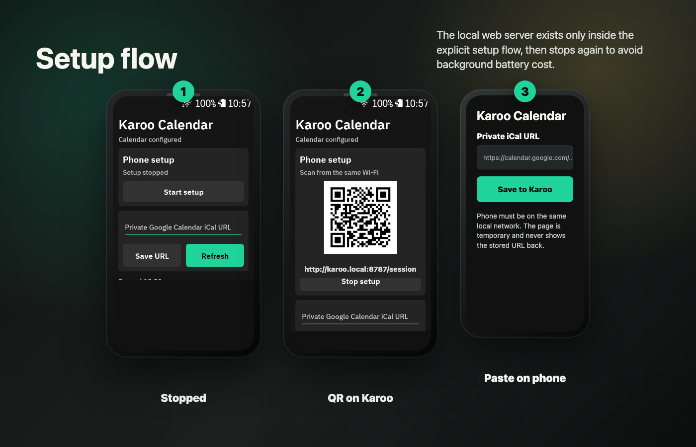
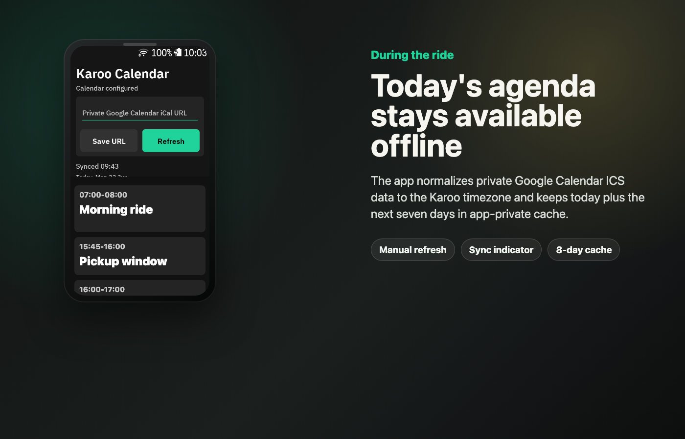

# Karoo Calendar



Karoo Calendar is a native Hammerhead Karoo app and ride-field extension for showing a private Google Calendar day agenda on the device. It uses the calendar's private iCal/ICS URL directly. There is no Google OAuth, no Google Play Services dependency, and no cloud relay.

## Features

- Native Android launcher app for setup, manual refresh, sync status, and today's agenda.
- Karoo graphical ride field `DATATYPE_CALENDAR_DAY` for in-ride agenda visibility.
- Private Google Calendar iCal/ICS feed support over HTTPS.
- Explicit phone setup flow with a temporary local QR web page.
- Dynamic Karoo IP handling: the QR URL is generated from the current local network address.
- Server off by default: the local setup server runs only after `Start setup`, and stops after `Stop setup`, leaving the app, or saving a URL.
- Offline cache for today plus the next seven days.
- Ride-field sync indicator:
  - `SYNC HH:mm` for a fresh cache.
  - `STALE HH:mm` when the cache is older than 30 minutes.
  - `CACHE HH:mm` when the latest refresh failed but cached data is available.
  - `NO SYNC` before the first successful refresh.



## Setup Flow

1. Open Karoo Calendar on the Karoo.
2. Tap `Start setup`.
3. Scan the QR code from a phone on the same local network.
4. Paste the private Google Calendar iCal URL into the phone page.
5. Submit the form. The URL is saved on the Karoo and the setup server stops.

The manual on-device input remains available as a fallback, but the intended setup path is QR plus phone paste.

## Agenda And Cache



The app fetches the private ICS feed, normalizes events to the Karoo device timezone, and stores normalized JSON in app-private preferences. The cache window is eight days total: today plus the next seven days. If a refresh fails, the latest cache remains visible.

Sync is opportunistic:

- on app open when the cache is stale,
- on manual refresh,
- while the ride field is visible, checked periodically.

## Privacy

- The private calendar URL is not committed, logged, or included in app resources.
- The private calendar URL is stored only in app-private Android preferences.
- The local setup page is tokenized per setup session.
- The local setup server is not started automatically and is stopped outside the explicit setup flow.
- Calendar access is read-only.

## Build

This project includes the Gradle wrapper.

```bash
./gradlew test assembleDebug
```

The debug APK is generated at:

```text
app/build/outputs/apk/debug/app-debug.apk
```

Install on a connected Karoo:

```bash
adb install -r app/build/outputs/apk/debug/app-debug.apk
adb shell monkey -p com.lenne0815.karoocalendar -c android.intent.category.LAUNCHER 1
```

For debug builds only, the calendar URL can be seeded via an Activity extra:

```bash
adb shell am start \
  -n com.lenne0815.karoocalendar/.MainActivity \
  --es com.lenne0815.karoocalendar.DEBUG_ICS_URL "https://example.com/calendar.ics"
```

## Implementation Notes

- Package: `com.lenne0815.karoocalendar`
- Extension id: `karoo-calendar`
- Karoo field type: `DATATYPE_CALENDAR_DAY`
- Local setup port: `8787`, with a short fallback port scan if unavailable.
- The bundled `third_party/karoo-ext-lib` module is Hammerhead `karoo-ext` 1.1.8 source from the official release tarball, used to avoid requiring GitHub Packages credentials during local builds.

## Verification

Current checks:

```bash
./gradlew test assembleDebug
```

Device verification should be done on a physical Karoo with ADB screenshots, HTTP checks for the setup flow, and logcat.
